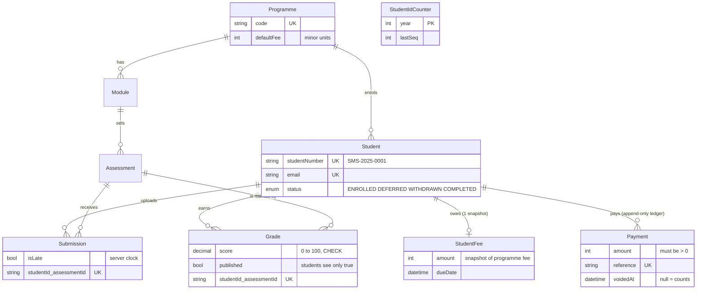

# Data model

Things that are deliberately NOT columns:

- **Outstanding balance**: always `fee - sum(non-voided payments)`.
- **Classification**: always computed from `score` (Fail < 40, Pass >= 40, Merit >= 60, Distinction >= 70).
- **Overdue**: always `balance > 0 AND dueDate < now`.
